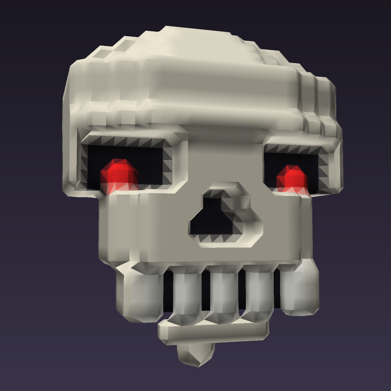
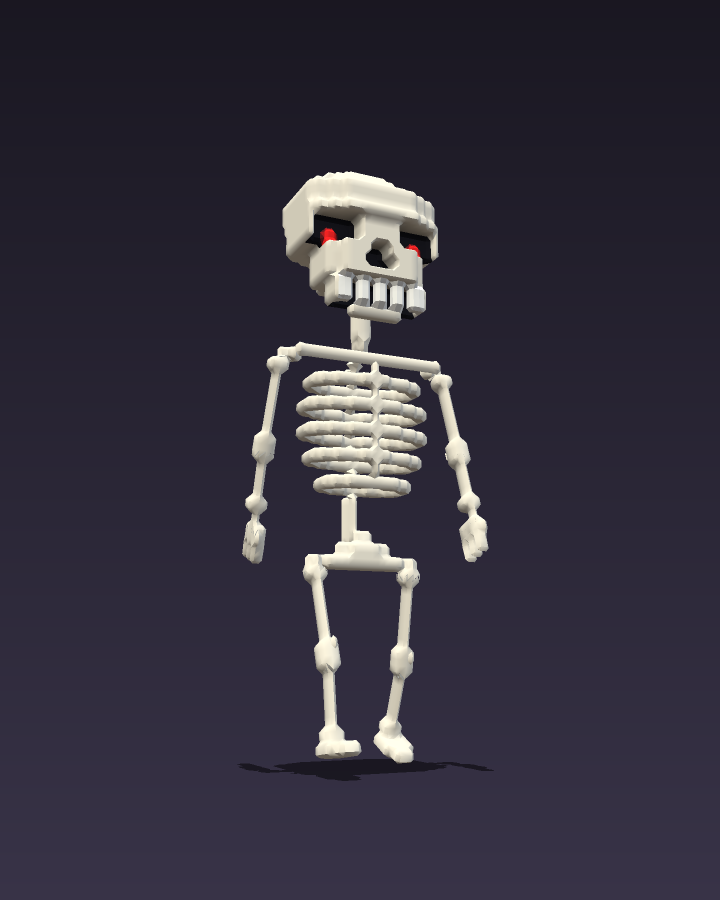
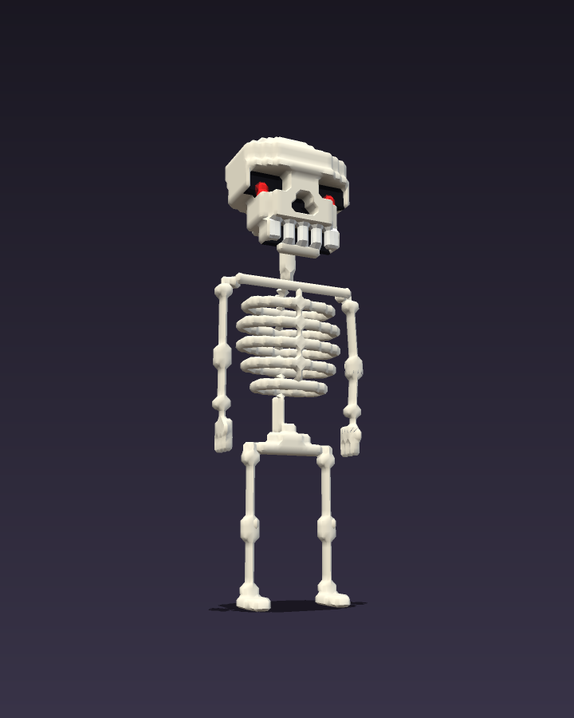
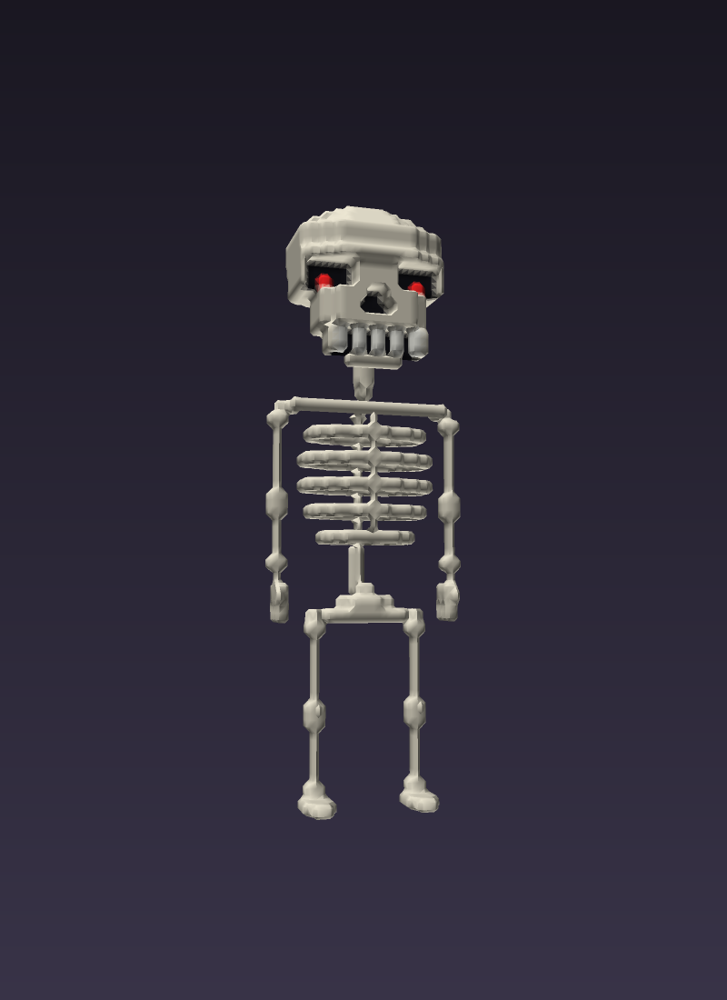
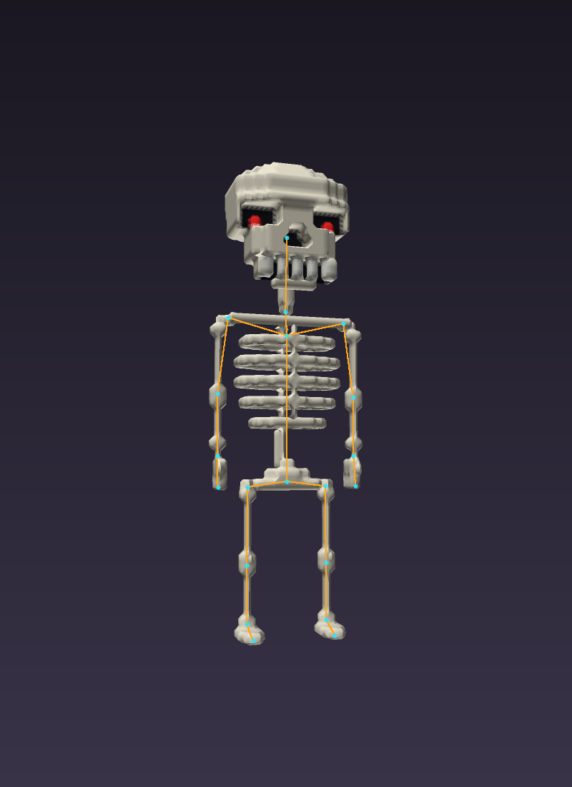

# foxel

**FXL** is a plain-text language for colored voxel models — modeling,
rigging, and animation in one ASCII file — designed so AI agents can
build and iterate on 3D assets with a human in the loop.

<p align="center">
  
  
  
</p>

A model is a stack of ASCII layers, bottom to top. Each character is a
voxel. The palette's alpha channel is a *density field*: the renderer
meshes it with goxel-style marching cubes, so sub-threshold "halo"
voxels round and smooth surfaces while full-density voxels stay crisp.
The same file declares an animation rig (joints placed with
battleship-style border notation, bones as joint pairs) and
CSS-keyframes-shaped animations that are pure *positions* — IK fills in
every joint, so nobody ever writes a rotation.

```
t = 8B4513          # trunk, brown
l = 22CC22          # leaves, green

trunk:
.....
..t..
.....
---
*trunk 2            # stamp the named layer twice
---
.lll.
lllll
.lll.
---
..l..
.lll.
..l..
```

That's a complete tree.

## Docs

- [`LANG.md`](LANG.md) — the FXL spec: layers, palette, density, defs
  and refs, rigs, bend hints, facing constraints, animations
- [`IMPL.md`](IMPL.md) — how goxel's marching cubes works (the meshing
  approach the renderer replicates)
- [`AGENTS.md`](AGENTS.md) — workflows and hard-won lessons for AI
  agents working in this repo

## Tools

Pure Python, no dependencies beyond numpy.

```sh
python3 render.py model.fxl                   # still render -> PNG
python3 render.py model.fxl --rig             # overlay joints/bones
python3 render.py model.fxl --anim walk       # animation -> looping APNG
python3 png2mp4.py model_walk.png             # APNG -> H.264 MP4 (macOS)
python3 fxl2gltf.py model.fxl                 # -> .glb for Godot etc.
```

The glTF export ships the mesh with vertex colors, the full skeleton
with rigid skinning, and every animation baked from the IK solver —
it drops straight into Godot with a working `AnimationPlayer`.

## Use with Claude Code

Three ways to get the foxel workflow into Claude Code:

- **Plugin (recommended)** — in any Claude Code session:

  ```
  /plugin marketplace add elliottdehn/foxel
  /plugin install foxel@foxel
  ```

  This installs the `foxel` skill globally: mention voxel assets or
  `.fxl` files and Claude clones the toolchain and follows the
  workflow in `AGENTS.md`.

- **Just ask** — paste this prompt into Claude Code:

  > Install the foxel skill: fetch
  > https://raw.githubusercontent.com/elliottdehn/foxel/main/skills/foxel/SKILL.md
  > and save it to ~/.claude/skills/foxel/SKILL.md

- **Working in this repo** — nothing to install: a checkout ships a
  project-level skill (`.claude/skills/foxel/`) automatically.

## Demo

`make_skeleton.py` generates `skeleton.fxl`: a ~7,400-voxel skeleton
with a hand-drawn skull, glowing red eyes, a 20-joint rig, and three
animations (`idle`, `walk`, `wave`) authored as sparse IK keyframes.

```sh
python3 make_skeleton.py
python3 render.py skeleton.fxl --anim walk --fps 14
```

<p align="center">
  
  
</p>
